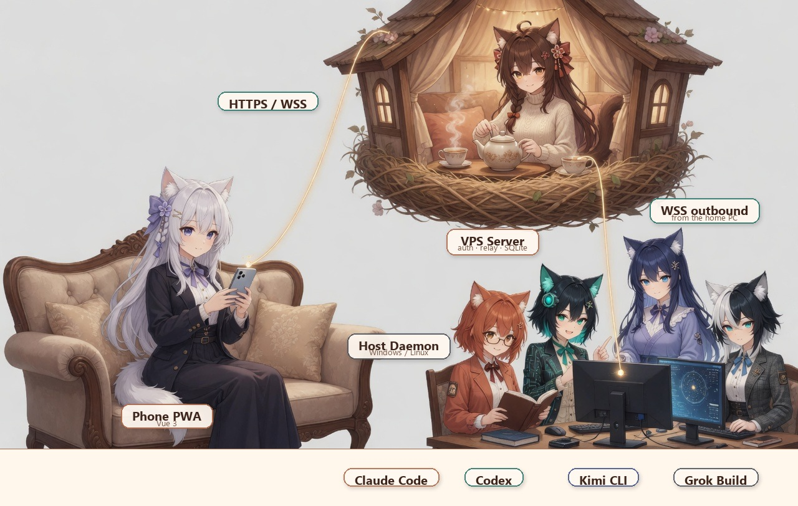

<div align="center">
  

  <h1>NekoNest · 猫娘乐园</h1>

  <p><strong>Continue coding-agent threads on your Windows or Linux host from your phone.</strong></p>
  <p>Self-hosted · Host outbound-only · Native session stores · Mobile PWA</p>

  <p>
    <a href="./README.zh-CN.md">简体中文</a> ·
    <a href="#quick-start">Quick start</a> ·
    <a href="./docs/README.md">Documentation</a> ·
    <a href="#license">License</a>
  </p>
  <p>
    <a href="https://github.com/klarkxy/nekonest/actions/workflows/ci.yml"></a>
  </p>
</div>

---

NekoNest connects a phone PWA to coding agents running on your own computer. A
small host daemon makes an outbound connection to your VPS, discovers native
agent threads, and relays prompts, attachments, output, and supported controls.
The home computer does not need an inbound port.

Native agent stores remain authoritative. NekoNest normally resumes existing
threads. A new native thread can be started from the phone only when the
installed agent advertises that capability and the target project has already
been discovered on the host.

## How it works

<div align="center">
  
</div>

## Supported agents

| Agent | Support level |
|---|---|
| Claude Code | Resume existing threads; controls depend on the installed CLI path |
| Codex | Full phone control when `codex app-server` is available; compatibility fallback otherwise |
| Kimi CLI | Compatibility resume |
| Grok Build | Compatibility resume |
| ZCode | Currently unavailable. Headless `zcode login` is broken upstream, so NekoNest does not advertise discover, send, or spawn |
| Cursor | Compatibility resume of Cursor Agent CLI (`cursor-agent`) when that CLI is installed |

Capabilities are detected at runtime. The PWA only enables controls advertised
by the connected daemon; run `nekonest-daemon -doctor` when a control is
unavailable. See [agent support](./docs/agent-capability-matrix.md) for the stable
support policy.

For Codex, enable **Plan mode** beside the composer when you want a planning
turn that can pause for structured questions on the phone. Normal mode remains
the default and continues to execute coding work. Prompts sent while a thread is
busy enter the durable FIFO and can be cancelled before native execution.
For long Codex turns, app-server `turn/started`/`turn/completed` state is the
authoritative signal for work launched through NekoNest. Native-store fallback
uses terminal events plus recent rollout activity and stays conservatively busy
instead of treating turn age alone as proof that a task stopped.

## Quick start

### 1. Run the Server on a VPS

The GHCR image includes the matching PWA:

```bash
sudo install -d -m 700 -o 10001 -g 10001 /var/lib/nekonest
docker run -d --name nekonest --restart unless-stopped \
  --read-only --cap-drop ALL --security-opt no-new-privileges:true \
  --tmpfs /tmp:rw,noexec,nosuid,nodev,size=64m,uid=10001,gid=10001,mode=1770 \
  -p 127.0.0.1:8080:8080 \
  -v /var/lib/nekonest:/data \
  -e NEKONEST_ADMIN_SECRET='long-random-string' \
  -e NEKONEST_BOOTSTRAP_TOKEN='different-long-random-string' \
  -e NEKONEST_ALLOWED_ORIGINS='https://nekonest.example.com' \
  -e NEKONEST_TRUST_PROXY=1 \
  ghcr.io/klarkxy/nekonest-server:latest
```

Terminate public HTTPS/WSS at a reverse proxy and keep port 8080 private. For
Compose, Caddy/Nginx, backups, and upgrades, follow the
[VPS guide](./docs/deploy-vps.md).

### 2. Install the host daemon

Install at least one supported agent CLI and use it once so NekoNest has a
native thread to discover. On Windows:

```powershell
$asset = "nekonest-daemon-windows-amd64.zip"
$base = "https://github.com/klarkxy/nekonest/releases/latest/download"
Invoke-WebRequest "$base/$asset" -OutFile $asset
Invoke-WebRequest "$base/checksums.txt" -OutFile checksums.txt
# Verify the archive against checksums.txt before extracting it.
Expand-Archive $asset -DestinationPath .\nekonest-daemon -Force
Set-Location .\nekonest-daemon
$env:NEKONEST_SERVER = "https://nekonest.example.com"
$env:NEKONEST_BOOTSTRAP_TOKEN = "same-bootstrap-token-as-vps"
.\nekonest-daemon.exe -register -name "Study PC"
.\nekonest-daemon.exe install
.\nekonest-daemon.exe start
```

Use the [Windows](./docs/deploy-windows.md) or
[Linux](./docs/deploy-linux.md) guide for installation and autostart.
Agent start capabilities are probed on daemon startup and then refreshed by
activity: active agents every five minutes, recently used agents hourly, and
agents with no thread activity in seven days daily.

### 3. Pair the phone

1. Open your NekoNest URL and complete setup with the admin secret.
2. Choose **Pair computer** and enter the code printed by the daemon.
3. Open **directory → agent → thread** and send a prompt.

Run the [acceptance checklist](./docs/e2e-smoke.md) after installation. For a
public VPS, use distinct admin and bootstrap secrets and review the
[security guide](./docs/security.md).

## Documentation

The [documentation index](./docs/README.md) separates installation and
operations from contributor references. User-visible history is in
[CHANGELOG.md](./CHANGELOG.md).

## License

**Star And Thank Author License (SATA) 2.0**. English [LICENSE](./LICENSE) is
authoritative; [LICENSE_zh](./LICENSE_zh) is a convenience translation.
